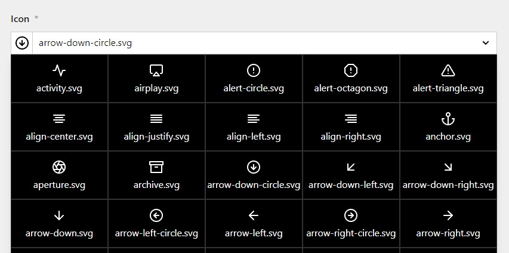

# Simplaflex Icon Select Field

> This plugin currently doesn't feature multi language support. Title and help text can only be set for one language.

This plugin allows you to specify an icon select field in your blueprints. 



## Installation
1. Put this entire folder in the `/site/plugins` directory of your kirby installation.
2. In line 7 of the `index.php` file in this directory adjust the path to the icons stored on your server you want to make selectable via this field.

## Field properties

| Name | Type | Default | Description |
|--- | --- | ---| ----|
| help | String | - | Optional help text below the field. |
| required | Boolean | false | If true, the field has to be filled in correctly to be saved. |
| title | String| - | A simple string that is displayed above the field and that can be used to access it in templates/snippets. |
| width | String | 1/1 | The width of the field in the field grid. Available widths: 1/1, 1/2, 1/3, 1/4, 2/3, 3/4 |

## How to use in templates/snippets

Simple Usage:
````php
<?= $page->icon() ?>
````

Get the public URL to the Icon:
````php
<?= $page->icon()->toIcon() ?>
````
You can use the output of the `toIcon` method in an regular &lt;img&gt; Tag.
Alternatively, for more control over the icon and being able to edit it using CSS, you can use the PHP `file_get_contents` method to embed the SVG itself.
